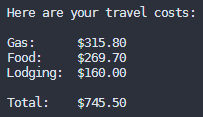

# Travel Costs
Estimates the cost of traveling based off of gas, food, and lodging.




## Usage
Modify the expenses object found in `TravelCosts.js` to suit your particular trip. 

```javascript
const expenses = {

    Gas: {
        mpg: 27,
        tripMiles: 3158,
        gasPrice: 2.7
    },

    Food: {
        people: 2,
        mealsPerDay: 3,
        days: 5,
        costPerMeal: 8.99
    },

    Lodging: {
        nights: 4,
        avgCost: 40
    }

}
```


Run `node TravelCosts` in your terminal to see the estimates.
